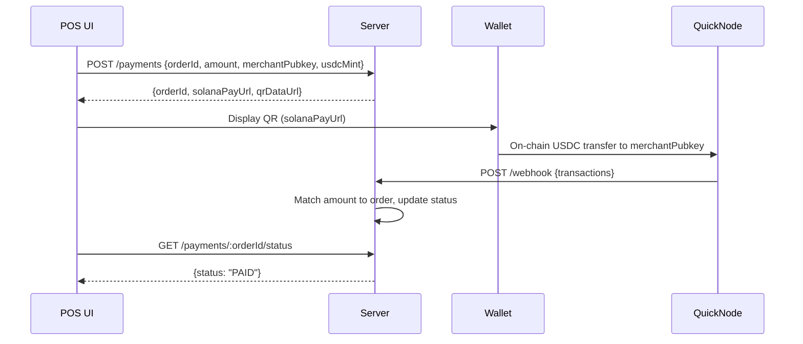

# Charon POS Starter (Solana Pay + POS Flow)

Accept USDC via Solana Pay from a POS order and mark it PAID on confirmation. Minimal, framework-agnostic starter to show the flow used with Clover.

## Highlights

- Generate Solana Pay URLs and QR codes for orders
- Confirm USDC payments instantly via QuickNode webhook
- 60–90s demo video: <Loom link>
- Compatible with any POS supporting createOrder/updateOrder APIs (Clover shown in demo)

## How It Works

1. POS creates an order and sends it to `/payments`
2. Server returns a Solana Pay URL and QR code
3. Customer scans QR with a wallet (e.g., Jupiter) and pays USDC
4. QuickNode webhook notifies server, updating order to PAID

# Quick Start

1. Copy server/.env.example to server/.env and set:
   - QUICKNODE_RPC_URL: QuickNode Solana mainnet RPC URL
   - QUICKNODE_API_KEY: QuickNode API key
   - QUICKNODE_WEBHOOK_ID: Webhook ID from QuickNode dashboard
   - MERCHANT_WALLET_ADDRESS: Merchant wallet (e.g., 5s8eKrWLo2Z3hJKaBjDxCTEHNDuskEk3rNvRMNmoK5bD)
   - USDC_MINT: USDC mint (e.g., EPjFWdd5AufqSSqeM2qN1xzybapC8G4wEGGkZwyTDt1v)

2. Set up QuickNode webhook:
   - In QuickNode dashboard, create a solanaWalletFilter webhook for MERCHANT_WALLET_ADDRESS
   - Set destination to https://<your-pinggy-url>.pinggy.link/webhook (run: ssh -p 443 -R0:localhost:3000 tcp.pinggy.io)

3. Install and run server:
      `cd server && npm i && npm run dev`

4. Install and run web:
      `cd web && npm i && npm run dev`

5. Open http://localhost:5173, create a test order, scan QR with a Solana wallet, and pay USDC. Status flips to PAID on confirmation.

*For demo safety, amounts are in USDC (mainnet). For devnet, use a devnet USDC mint and set SOLANA_CLUSTER=devnet.*

# Endpoints
   - POST /payments → { orderId, amount, merchantPubkey, usdcMint } → { orderId, solanaPayUrl, qrDataUrl }
   - GET /payments/:orderId/status → { status: "PENDING" | "PAID" }
   - POST /webhook → QuickNode transaction payload → updates order status
   - POST /refunds → 501 Not Implemented (stub)

# Notes
   - In-memory Map stores pending orders for demo simplicity
   - Webhook matches USDC transfers by amount (±0.01), assuming unique amounts
   - No persistence; restart clears state
   - Secure webhooks with QUICKNODE_SECURITY_TOKEN in production

# Refunds (v1 Policy)
   - On-chain refunds return to the original payer address. Merchant maintains a refund buffer; refunds blocked if below threshold.
   - Use Privy for merchant wallets and policies to handle the automated refunds.

# Requirements
Node 18+
QuickNode account (RPC and webhook)
Pinggy for local webhook testing

# Config
QUICKNODE_WEBHOOK_ID=
QUICKNODE_RPC_URL=
QUICKNODE_SECURITY_TOKEN=
QUICKNODE_API_KEY=
MERCHANT_WALLET_ADDRESS=
USDC_MINT=
PORT=3000
CORS_ORIGIN=http://localhost:5173
SOLANA_CLUSTER=mainnet-beta

# Links
Solana Pay: https://docs.solanapay.com
USDC on Solana: https://docs.circle.com
QuickNode: https://docs.quicknode.com
Pinggy: https://pinggy.io

## License
MIT

### .env.example
QUICKNODE_WEBHOOK_ID=
QUICKNODE_RPC_URL=
QUICKNODE_SECURITY_TOKEN=
QUICKNODE_API_KEY=
MERCHANT_WALLET_ADDRESS=
USDC_MINT=
PORT=3000
CORS_ORIGIN=http://localhost:5173
SOLANA_CLUSTER=mainnet-beta
